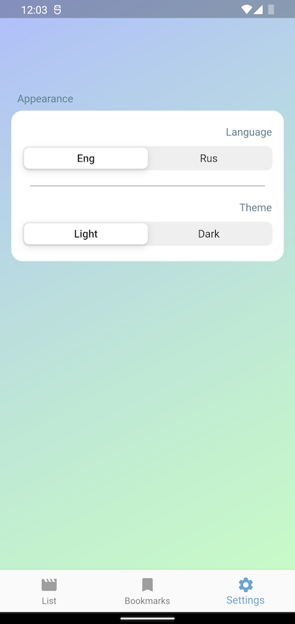

# MoviesApp (Android/iOS)

MoviesApp - cross platform applications on Flutter for Android/iOS, shows the latest premieres in cinemas with descriptions, screenshots and video trailers. 

## Features

- Search movie by name, month/year premier
- Light/Dark mode toggle
- Ru/En language toggle
- Movie details info
- Play available trailers
- Save in favorite

## Libraries & Tools Used

- BLoC
- Http
- Provider
- Json Serialization
- Flutter_translate
- Carousel_slider
- Youtube_player_flutter
- Cached_network_image
- Month_picker_dialog

## Before Run

The application uses a free unofficial kinopoisk.ru API that provides access to site data. For access, you must receive a token, which will be available after registration at https://kinopoiskapiunofficial.tech and put it in the file lib/network/apiService.dart

## Screenshots

  
   
  

